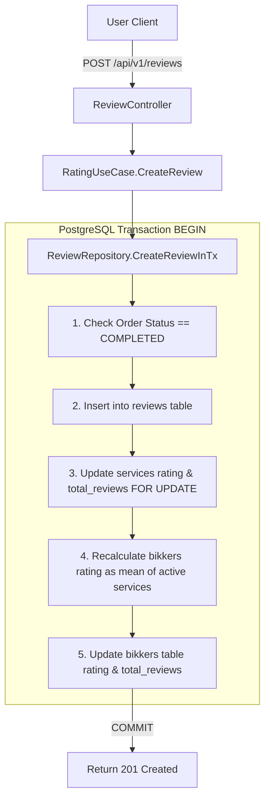

# Bikko Backend API - Dependency Graph Index

> **O(1) Direct Lookup Index**: Use this document to instantly resolve HTTP Routes, Controllers, UseCases, Repositories, Domain Entities, Database Tables, and Redis Cache Keys without recursive file scanning.

---

## 1. API Route & Component Inverted Index (O(1) Direct Lookup)

| Method | Endpoint Path | Controller | UseCase / Service | Repository | Domain Entity | DB Table(s) / Cache Key |
| :--- | :--- | :--- | :--- | :--- | :--- | :--- |
| `GET` | `/` | Anonymous Handler | N/A | N/A | N/A | N/A |
| `GET` | `/api/v1/health` | `HealthController.CheckHealth` | N/A | N/A | N/A | Memory Check |
| `GET` | `/api/v1/home` | `HomeController.GetHome` | `HomeUseCase.GetHomeFeed` | `CategoryRepository`, `ServiceRepository` | `HomeResponse`, `HomeCollection` | `categories`, `services`, `bikkers`<br>Keys: `home:categories` (24h), `home:near:{geohash}` (5m), `home:advice` (1h) |
| `GET` | `/api/v1/categories` | `HomeController.GetCategories` | `HomeUseCase.GetCategories` | `CategoryRepository` | `Category` | `categories`<br>Key: `home:categories` |
| `GET` | `/api/v1/categories/:id` | `HomeController.GetCategoryByID` | `HomeUseCase.GetCategoryByID` | `CategoryRepository` | `Category` | `categories` |
| `GET` | `/api/v1/search` | `SearchController.Search` | `SearchUseCase.Search` | `ServiceRepository`, `CategoryRepository` | `SearchResponse` | `services`, `categories` |
| `POST` | `/api/v1/auth/register`| `AuthController.Register` | `AuthService.Register` | `UserRepository` | `User` | `users` |
| `POST` | `/api/v1/auth/login` | `AuthController.Login` | `AuthService.Login` | `UserRepository` | `User` | `users` |
| `GET` | `/api/v1/profile` | `ProfileController.GetProfile` | `ProfileService.GetProfile` | `UserRepository` | `Profile` | `users` (JWT Protected) |
| `DELETE` | `/api/v1/profile` | `ProfileController.DeleteAccount` | `ProfileService.DeleteAccount` | `UserRepository` | N/A | `users` (Soft Delete, JWT Protected) |
| `POST` | `/api/v1/reviews` | `ReviewController.CreateReview`| `RatingUseCase.CreateReview` | `ReviewRepository.CreateReviewInTx` | `Review`, `Order`, `Service`, `Bikker` | `reviews`, `orders`, `services`, `bikkers` (Transactional Cascade) |
| `POST` | `/api/v1/storage/upload-url` | `StorageController.GenerateUploadURL` | `StorageUseCase.GeneratePreSignedURL` | `StorageService` (Cloudflare R2) | N/A | Cloudflare R2 Bucket |
| `GET` | `/api/v1/bootstrap` | `BootstrapController.GetBootstrap` | `RedisService.GetFeatures` | N/A | `BootstrapResponse` | Redis Key: `bikkofy:features` |
| `GET` | `/api/v1/services/:id` | `ServiceController.GetServiceByID` | `ServiceUseCase.GetServiceByID` | `ServiceRepository` | `Service` | `services`, `categories`, `bikkers` |
| `GET` | `/api/v1/bikkers/:id` | `BikkerController.GetBikkerByID` | `BikkerUseCase.GetBikkerByID` | `BikkerRepository` | `Bikker` | `bikkers`, `services`, `reviews` |
| `GET` | `/api/v1/solicitations` | `SolicitationController.GetSolicitations` | `SolicitationUseCase.GetSolicitations` | `SolicitationRepository` | `Solicitation` | `quote_requests`, `orders` |
| `GET` | `/api/v1/solicitations/:id` | `SolicitationController.GetSolicitationByID` | `SolicitationUseCase.GetSolicitationByID` | `SolicitationRepository` | `Solicitation` | `quote_requests`, `orders` |
| `POST` | `/api/v1/solicitations` | `SolicitationController.CreateSolicitation` | `SolicitationUseCase.CreateSolicitation` | `SolicitationRepository`, `ServiceRepository` | `Solicitation` | `quote_requests` |
| `PATCH`| `/api/v1/solicitations/:id/status` | `SolicitationController.UpdateStatus` | `SolicitationUseCase.UpdateStatus` | `SolicitationRepository` | `Solicitation` | `quote_requests`, `orders` (max 5 counter-offers) |

---

## 2. Package & Layer Architecture Call Graph

```
[ HTTP Client (Android / Web) ]
               |
               v
[ Gin Router (internal/router/router.go) ]
               |
               v
[ Controllers (internal/infrastructure/http/controller/ & internal/controller/) ]
               |
               v
[ UseCases / Services (internal/usecase/ & internal/service/) ]
       /       |       \
      /        v        \
     v   [ Redis Cache ]  v
[ Postgres Persistence ]  [ Cloudflare R2 Storage ]
 (pgxpool + PostGIS)      (AWS SDK v2 S3 Client)
       |
       v
[ PostgreSQL 16 + PostGIS Database ]
 (Tables: users, bikkers, categories, services, quote_requests, orders, reviews)
```

### Source Code Files Location Table

| Layer | Package / Subpackage | Key Source Files | Exact File Link |
| :--- | :--- | :--- | :--- |
| **Entry Point** | `main` | `cmd/api/main.go` | [main.go](file:///Users/emersontorres/projects/bikko-app/cmd/api/main.go) |
| **Config** | `config` | `config/config.go` | [config.go](file:///Users/emersontorres/projects/bikko-app/config/config.go) |
| **Routing** | `router` | `internal/router/router.go` | [router.go](file:///Users/emersontorres/projects/bikko-app/internal/router/router.go) |
| **HTTP Controller** | `controller` / `infraCtrl` | `home_controller.go`, `search_controller.go`, `review_controller.go`, `storage_controller.go`, `auth_controller.go` | [home_controller.go](file:///Users/emersontorres/projects/bikko-app/internal/infrastructure/http/controller/home_controller.go) |
| **Business Logic** | `usecase` / `service` | `home_usecase.go`, `search_usecase.go`, `rating_usecase.go`, `storage_usecase.go`, `auth_service.go` | [home_usecase.go](file:///Users/emersontorres/projects/bikko-app/internal/usecase/home_usecase.go) |
| **Persistence** | `postgres` | `client.go`, `service_repository.go`, `category_repository.go`, `review_repository.go` | [service_repository.go](file:///Users/emersontorres/projects/bikko-app/internal/infrastructure/persistence/postgres/service_repository.go) |
| **Cache** | `cache` | `redis.go` | [redis.go](file:///Users/emersontorres/projects/bikko-app/internal/infrastructure/cache/redis.go) |
| **Cloud Storage** | `storage` | `r2.go` | [r2.go](file:///Users/emersontorres/projects/bikko-app/internal/infrastructure/storage/r2.go) |
| **Database Schema** | `migrations` | `000001_init_schema.up.sql` | [000001_init_schema.up.sql](file:///Users/emersontorres/projects/bikko-app/migrations/000001_init_schema.up.sql) |

---

## 3. Detailed Workflow Mermaid Diagrams

### 1. Dynamic Home Feed Aggregation with Redis 3-Tier Caching & PostGIS Fallback
```mermaid
graph TD
    Client[Android App] -->|GET /api/v1/home?lat=-23.55&lon=-46.63| Router[Gin Router]
    Router --> HC[HomeController.GetHome]
    HC --> HUC[HomeUseCase.GetHomeFeed]

    subgraph Tier 1: Categories
        HUC -->|GetCategories| RedisCat{Redis home:categories?}
        RedisCat -- Hit --> CatData[Categories Array]
        RedisCat -- Miss --> CatDB[(Postgres categories table)]
        CatDB -->|Set TTL 24h| RedisCat
    end

    subgraph Tier 2: Spatial Proximity (PostGIS)
        HUC -->|Geohash lat,lon| RedisNear{Redis home:near:geohash?}
        RedisNear -- Hit --> NearData[Near Services Array]
        RedisNear -- Miss --> PostGIS[(PostgreSQL PostGIS Query)]
        PostGIS -->|ST_DWithin radius 10km| PostGIS
        PostGIS -->|Set TTL 5m| RedisNear
    end

    subgraph Tier 3: Recommendations / Advice
        HUC -->|GetAdviceServices| RedisAdv{Redis home:advice?}
        RedisAdv -- Hit --> AdvData[Featured Advice Array]
        RedisAdv -- Miss --> AdvDB[(Postgres services ORDER BY reviews_average)]
        AdvDB -->|Set TTL 1h| RedisAdv
    end

    CatData --> Agg[Assemble HomeResponse Collections]
    NearData --> Agg
    AdvData --> Agg
    Agg --> Client
```

### 2. Transactional Review Cascade Workflow (`ReviewRepository.CreateReviewInTx`)


### 3. PostGIS Radius Search Query Logic
```sql
-- Spatial Query executed by service_repository.go
SELECT s.id, s.bikker_id, s.name, s.reviews_average, ST_Y(s.location_geom::geometry) as lat, ST_X(s.location_geom::geometry) as lon
FROM services s
WHERE s.is_active = TRUE
  AND ST_DWithin(s.location_geom, ST_SetSRID(ST_MakePoint($1, $2), 4326)::geography, $3)
ORDER BY s.location_geom <-> ST_SetSRID(ST_MakePoint($1, $2), 4326)::geography ASC
LIMIT $4;
```
